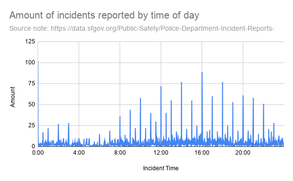
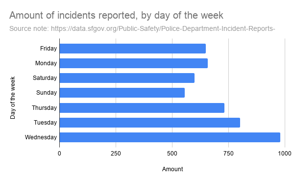
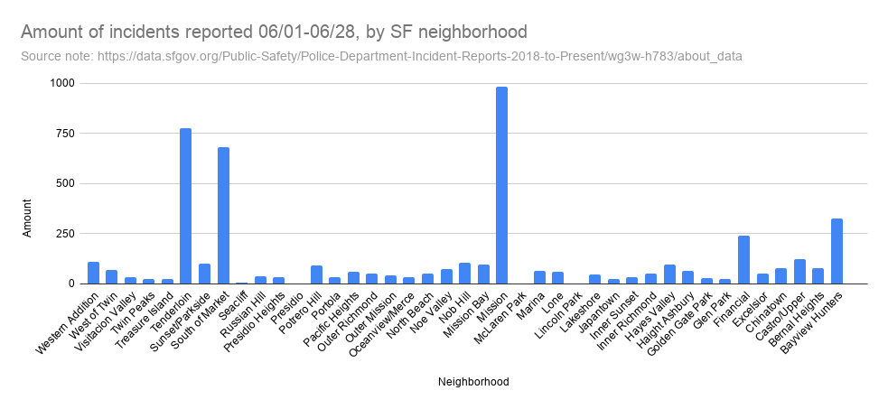

# All SFPD reports since the beginning of June, organized by manner and location of crime.

[This is my source.](https://data.sfgov.org/Public-Safety/Police-Department-Incident-Reports-2018-to-Present/wg3w-h783/about_data)

In this project, I explore all reports to SFPD from June 1st 2026, up until today, June 28th. The dataset has lots of variabels, such as the time of day and day of the week that both the incident and report took place at. 

## Where the data came from, and potential challenges

I downloaded my dataset from the SF OpenData database, but the data originally comes from the SFPD themselves, who review and upload it daily. One initial challenge is that some data/reports are missing because “incident reports may be removed from the dataset if in compliance with court orders to seal records or for administrative purposes such as active internal affair investigations and/or criminal investigations.” I believe it is a trustworthy source because it comes directly from the group, a government institution, who receives the reports in the first place, and they can only omit data for very specific and important reasons, not just because they don’t want it published. It is possible that the people behind the data have a narrative or agenda, but I seriously doubt that it is reflected in the dataset. The entire dataset is automatically recorded as reports come in and then after review, automatically published. It is not curated by the PD or anything of the sort. The original dataset started in 2018 (and continues until today), but my computer could not handle that much data so I shortened it to only include data/reports from the start of June 2026 until today, June 28th, 2026. I also cut out some of the variables that I can’t use for anything effectively, like the CAD number and latitude/longitude. I also filtered out any datapoints with any of the remaining variables blank, leaving us with 5005 reports for the month of June (so far).

## Data analysis
[My spreadsheet](https://docs.google.com/spreadsheets/d/1oRCNj4jO590-gV_jfrCDjAA_VgY8oan0oezTGn4QVxs/edit?usp=sharing)

I found it interesting that Wednesday had by far the most reports filed out of all the days of week, with 979. Tuesday, the next highest, had only 802, just under 82% of those reported on Wednesdays. I also explored the categories of incidents reported and found it very interesting that there were several categories with easily over a hundred incidents reported, but also multiple categories with only one incident reported. Obviously some crimes are a lot more common than others, but I did not expect the disparity that is aggravated assault and drug violation having 134 and 761 incidents, respectively, compared to only one reported incident of stalking. The other single-digit amount of reported incident categories are vehicle misplaced, suspicious package, vehicle impound, sex offense, robbery-carjacking, rape, prostitution, attempted motor vehicle theft, liquor law violation, kidnapping, human trafficking/commercial sex acts, fire report, extortion- blackmail, case closure, burglary (commercial), and arson. Some of these are very random and rare, but I am very surprised that some of these were only reported a single-digit amount of times in a 4-week span. I created another pivot table to give me the count of how many incidents were reported by the neighborhood and the results were very interesting. Some neighborhoods, like the Presidio, McLaren Park, and Lincoln Park only had 1 or 2 entire incidents reported there, while larger, more chaotic neighborhoods like the Tenderloin, and South of Market have upwards of 600 reports each. That is ~2.5 incidents reported in each of those neighborhoods every day. 

## Data visualizations
The line chart shows how many incidents are being reported each minute. Those huge spikes occur at almost every full hour. I do not know why, it isn’t explained at all, but I would assume it is because when asked when the incident occurred, people are unsure and estimate and simply answer with the closest full hour. 

The column chart shows how the reports are distributed across each SF neighborhood. The Mission, South of Market, and the Tenderloin have significantly higher amounts of incidents that occurred within them than all of the other neighborhoods. On the other hand, the Presidio, McLaren Park, Lincoln Park, and Seacliff all had 3 or less incidents reported within them.

The bar chart compares how many incidents were committed or occurred on each day of the week. The amounts are largely similar but it is interesting that Tuesday and Wednesday have the highest number of reports. I would’ve assumed it would be on the weekend when people aren’t at work that the most reports are placed, or at least on Thursdays or Fridays when people are drinking the most. 

##  Ending summary, ethical concerns, reporting process
While this data could unintentionally cause harm to some communities, I think bringing awareness and understanding of SF crime is worth the small cost that it might incur. This dataset and my exploration of it reveals some very interesting trends, some of which I wish I could explore the reasoning behind. There is no identifying information for individuals in the dataset, so no one can be affected on an individual level. The only way that it could be used to disparage communities is because of the three neighborhoods with high report numbers: the Mission, South of Market, and the Tenderloin. However, I think everyone is already aware of these disproportionate amounts of crime and no one would feel any more negatively towards those areas. It is very much public knowledge that those areas are more busy, poor, and dangerous and it is just a matter of fact and how it has always been. The additional reporting that could help make this a complete and ethical story is details of the victims and perpetrators, although the latter would not be possible for a large portion of the reports. It would also make the story and dataset more complete if the result of the report was listed, like if it was taken to court and the result found there as well. The fact that those are missing somewhat limits what we can do with the data. For example, I would love to see, by neighborhood, at what rate the perpetrators are held accountable, and at what rate they go to jail potentially. 
